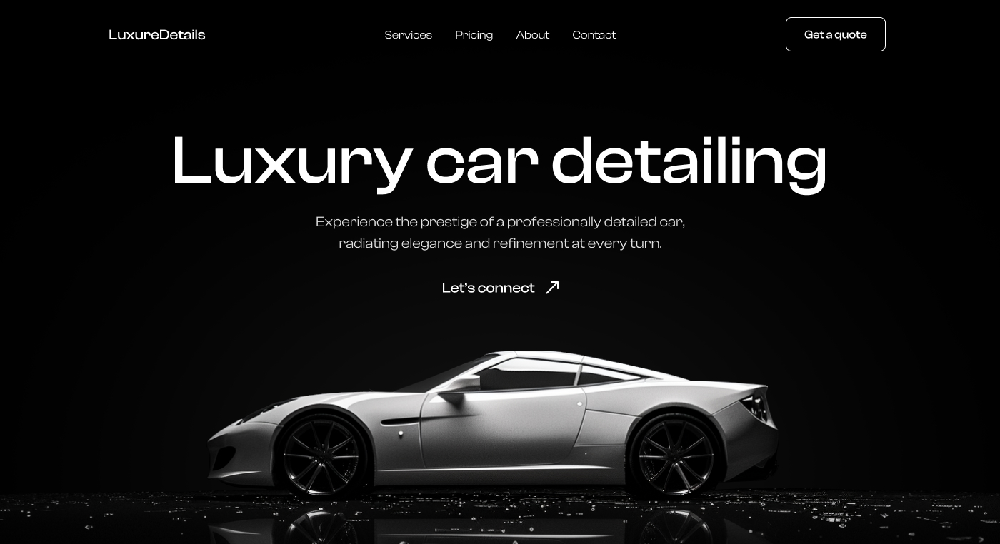

# 🚘 Luxury Car Detailing — Landing Page



A responsive landing page for a luxury car detailing service, built with semantic HTML5 and modern CSS3 practices.

- 🔗 [Live Demo](https://zhaslansabyr.github.io/luxure-details/)
- 🎨 [Figma Design](https://www.figma.com/design/hOdxd3zRJtasmKT4jUWNFg/LuxureDetails?node-id=0-1&t=jcsYLpcN2IBDPT0Z-1)

---

## ✨ Features

- ✅ Semantic and accessible HTML5 structure
- 🎨 CSS3 with modern resets (Normalize.css)
- 📱 Fully responsive layout for all screen sizes
- 🧹 Clean CSS structure with separate folders for base styles and components
- 🗂️ Organized asset management (icons, fonts, images)

---

## 📁 Project Structure

```
├── index.html
│
├── styles/
│   │── components/
│   │── blocks/
│   │── base/
│   └── main.css
│
├── assets/
│   │── images/
│   │── icons/
│   └── fonts/
│
├── README.md
└── .gitignore
```

---

## 📬 Contact

- 📲 Telegram: [@zhaslansabyr](https://t.me/zhaslansabyr)
- 💼 LinkedIn: [zhaslansabyr](https://linkedin.com/in/zhaslansabyr)
- 🐱 GitHub: [zhaslansabyr](https://github.com/zhaslansabyr)
- 📧 Email: [zhaslansabyr@gmail.com](mailto:zhaslansabyr@gmail.com)
